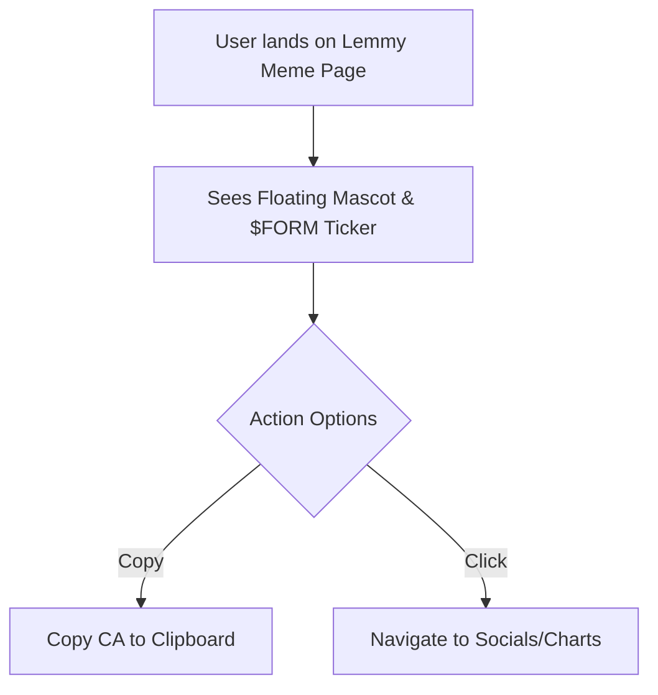

## 1. Product Overview
A high-impact, attention-grabbing 1-page landing page for a meme token on pump.fun. The mascot is Lemmy the ghost.
- **Main Purpose**: To serve as the primary landing page for the $FORM token, capturing the attention of crypto "apes" in 3 seconds or less.
- **Target Audience**: Crypto traders, meme coin enthusiasts, and "apes" who prefer pure meme culture over utility.
- **Market Value**: Establishing a strong, memorable, and viral brand identity for the $FORM token.

## 2. Core Features

### 2.1 Feature Module
1. **Hero Section**: Massive floating mascot (Lemmy), giant bold ticker ($FORM), and eye-catching animations.
2. **Contract Info**: Prominently displayed Contract Address (CA) with a one-click "Copy" function.
3. **Socials & Links**: Big, bold buttons linking to X (Twitter), Telegram, pump.fun, and Dexscreener.

### 2.2 Page Details
| Page Name | Module Name | Feature Description |
|-----------|-------------|---------------------|
| Home Page | Hero Banner | Floating Lemmy SVG, large flashy typography, chaotic but cohesive meme aesthetic |
| Home Page | CA Section | Displays CA: 9KgZ7RbfJdUftzxcEmzg6Rz2AUsb8z8MsCVkScHHpump with copy-to-clipboard |
| Home Page | Social Links | Highly interactive buttons for X, Telegram, pump.fun, and Dexscreener |

## 3. Core Process
The user lands on the page, is immediately struck by the floating Lemmy mascot and bold typography, sees the token ticker, copies the CA, and clicks out to socials or trading platforms.

## 4. User Interface Design
### 4.1 Design Style
- **Primary Colors**: Deep Meme Purple (`#9D60FF` - derived from the SVG background), High-Contrast Neon Accents (e.g., Cyber Yellow or Slime Green) to make the text pop.
- **Button Style**: Brutalist, oversized, heavy drop-shadows, bouncy hover animations.
- **Typography**: Extremely bold, loud, and impactful display fonts (e.g., Impact, Comic Sans ironically, or a very heavy sans-serif like Black Ops One or Rubik Mono One).
- **Layout Style**: Centered, chaotic but structured single-column layout optimized for immediate scrolling and clicking.
- **Animations**: Bouncing, floating, rotating elements. "Shake" effects on hover to stimulate the ape brain.

### 4.2 Page Design Overview
| Page Name | Module Name | UI Elements |
|-----------|-------------|-------------|
| Home Page | Mascot | SVG Lemmy with continuous floating animation (`translateY` looping) |
| Home Page | Typography | Ticker $FORM with glowing or glitching text effects |
| Home Page | Buttons | Oversized, tactile buttons with transform-scale on click |

### 4.3 Responsiveness
Desktop-first with seamless mobile adaptation. The layout will scale down perfectly, keeping the mascot front-and-center on mobile screens, as most crypto traders browse Twitter/Telegram from their phones.
