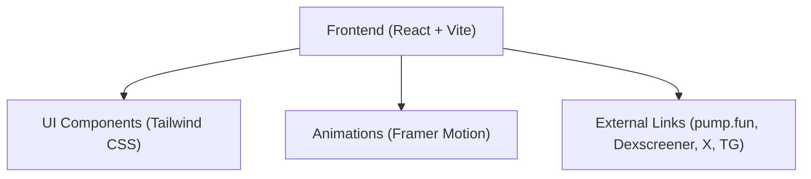

## 1. Architecture Design
A purely frontend Single Page Application (SPA) designed for maximum performance, visual impact, and instant loading.

## 2. Technology Description
- **Frontend Framework**: React@18
- **Build Tool**: Vite
- **Styling**: Tailwind CSS v3
- **Animations**: Framer Motion (for floating mascot, bouncy buttons, and scroll reveals)
- **Icons**: Lucide React (or custom SVG icons for specific crypto platforms if needed)
- **State Management**: React Hooks (useState for copy-to-clipboard feedback)

## 3. Route Definitions
| Route | Purpose |
|-------|---------|
| `/`   | Main Landing Page (Hero, Token Info, Socials) |

## 4. API Definitions
*No backend API required. This is a static frontend meme page.*

## 5. External Integrations
- **Social Links**: Standard `<a>` tags with `target="_blank" rel="noopener noreferrer"`.
- **pump.fun**: Link directly to the token's trading pair.
- **Dexscreener**: Link directly to the chart.
- **Clipboard API**: Used for the "Copy CA" functionality using `navigator.clipboard.writeText`.
